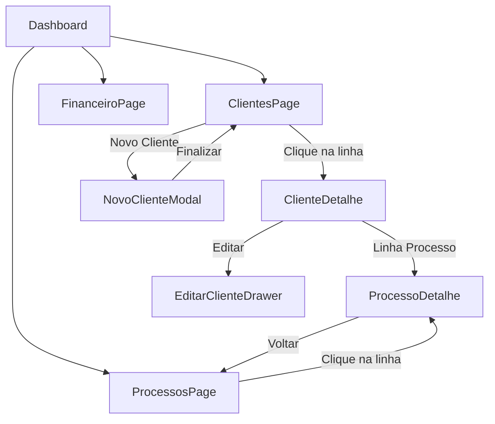

# Auditoria de Botões e Fluxo de Dados
Data: 22/05/2026

## 1. Resumo da Auditoria
Esta auditoria revisou as principais páginas do sistema (**Dashboard**, **Clientes**, **Processos**) e suas respectivas telas de detalhes. O objetivo foi validar as conexões entre páginas, o funcionamento dos botões e a integridade do fluxo de dados (especialmente na criação de clientes e processos).

---

## 2. Tabela de Conexões (Mapeamento de Botões)

| Página Original | Elemento/Botão | Tipo | Destino / Ação | Status |
| :--- | :--- | :--- | :--- | :--- |
| **Sidebar** | Ícone Dashboard | Link | `/` | ✅ Funcional |
| **Sidebar** | Ícone Clientes | Link | `/clientes` | ✅ Funcional |
| **Sidebar** | Ícone Processos | Link | `/processos` | ✅ Funcional |
| **Sidebar** | Ícone Financeiro | Link | `/financeiro` | ✅ Funcional |
| **Dashboard** | Card "Processos Ativos" | Informativo | (Visual apenas) | ℹ️ Sem link |
| **ClientesPage** | Botão "Novo Cliente" | Ação | Abre Modal de Cadastro | ✅ Funcional |
| **ClientesPage** | Linha da Tabela | Link | `/clientes/:id` | ✅ Funcional |
| **ClientesPage** | Ação: Ver Detalhes | Link | `/clientes/:id` | ✅ Funcional |
| **ClientesPage** | Ação: Editar | Drawer | Abre EditarClienteDrawer | ✅ Funcional |
| **ClienteDetalhe** | Botão "Editar" (Cabeçalho) | Drawer | Abre EditarClienteDrawer | ✅ Funcional |
| **ClienteDetalhe** | Botão "Novo Processo" | Ação | (Em desenvolvimento) | ⚠️ Sem handler |
| **ClienteDetalhe** | Aba: Resumo | Tab | Alterna visualização | ✅ Funcional |
| **ClienteDetalhe** | Linha "Processos Recentes" | Link | `/processos/:id` | ✅ Funcional |
| **ProcessosPage** | Linha da Tabela | Link | `/processos/:id` | ✅ Funcional |
| **ProcessosPage** | Filtro Tribunal | Filtro | Filtra lista (Removido "Todos")| ✅ Ajustado |
| **ProcessoDetalhe** | Botão "Editar Info" | Ação | (Em desenvolvimento) | ⚠️ Sem handler |
| **ProcessoDetalhe** | Abas (Resumo, Fin, etc) | Tab | Alterna visualização | ✅ Funcional |

---

## 3. Organograma Esquematizado (Fluxo de Navegação)

---

## 4. Auditoria de Integridade de Dados

### Problema Identificado (Polo Ativo/Passivo)
**Relato do Usuário:** *"Cadastrei um cliente cível como autor/réu ativo e na página de detalhe aparece passivo."*
**Causa Raiz:** A lógica de salvamento em `ClientesPage.tsx` verificava apenas se o valor literal era `"autor"`. Como os componentes de campo (ex: `CivilFields.tsx`) forneciam o valor `"Ativo"`, a verificação falhava e o sistema aplicava o padrão `"Passivo"`.
**Ação Tomada:** Refatorada a função de extração de Polo para ser case-insensitive e suportar múltiplos termos (`Ativo`, `autor`, `reu`, `Passivo`).

### Sincronização entre Cliente e Processo
*   A criação de um Cliente agora dispara corretamente a criação de um Processo vinculado.
*   **Polo Ativo/Passivo no Processo:** Corrigido para atribuir o nome do cliente ao polo correto (Ativo ou Passivo) no objeto do Processo criado automaticamente.

### Fluxo Financeiro
*   Valores inseridos no `NovoClienteModal` (Valor total, entrada, parcelas) agora geram transações financeiras reais no `mockFinanceiro`.
*   As transações são exibidas na aba "Financeiro" tanto do Cliente quanto do Processo.

---

## 5. Próximos Passos Recomendados
1.  **Implementar Handlers:** Adicionar o funcionamento real para o botão "Novo Processo" dentro de `ClienteDetalhe.tsx`.
2.  **Edição de Processo:** Criar o Modal/Drawer para "Editar Informações" na página `ProcessoDetalhe.tsx`.
3.  **Dropdown Financeiro:** (Solicitado anteriormente) Implementar a visualização expandida das parcelas na aba financeiro com o comportamento de dropdown.
