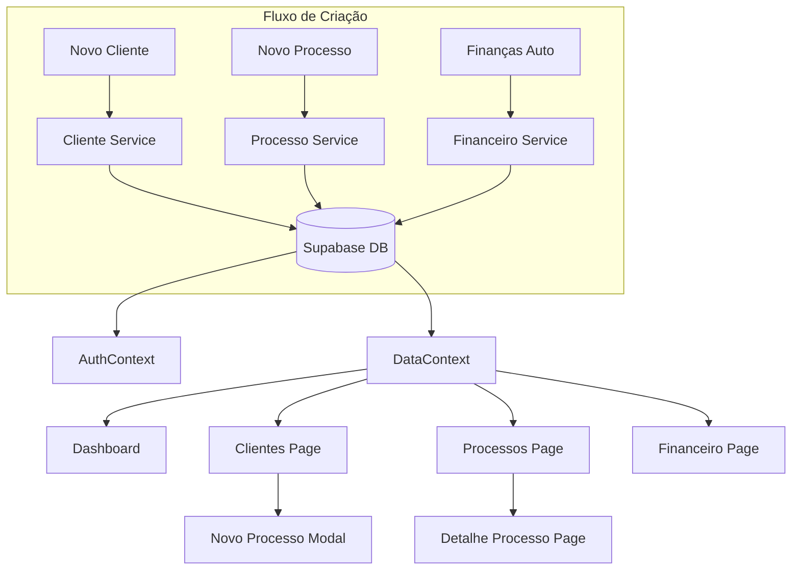

# Auditoria de Conexões e Fluxos do Sistema - [26/05/2026]

## 1. Visão Geral
Esta auditoria analisa as conexões entre as páginas de Dashboard, Clientes e Processos, verificando a consistência dos dados e o funcionamento dos botões e links.

## 2. Tabela de Conexões de Botões

| Origem | Botão/Ação | Destino | Descrição da Conexão | Status |
|---|---|---|---|---|
| Dashboard | Card "PROCESSOS ATIVOS" | /processos | Link direto para listagem filtrada | ✅ OK |
| Dashboard | Card "MEUS CLIENTES" | /clientes | Link direto para listagem de clientes | ✅ OK |
| Dashboard | Item "Movimentação" | /processos/:id | Detalhe do processo específico | ✅ OK |
| Dashboard | Item "Audiência" | /processos/:id | Detalhe do processo da audiência | ✅ OK |
| Clientes Page | Botão "Novo Cliente" | Modal | Abre formulário de cadastro | ✅ OK |
| Clientes Page | Card Cliente | Modal Detalhe | Abre detalhes do cliente | ✅ OK |
| Clientes Page | Ação "Novo Processo" | Modal Processo | Abre cadastro com cliente pré-selecionado | ✅ OK |
| Processos Page | Botão "Novo Processo" | Modal | Abre formulário de cadastro de processo | ✅ OK |
| Processos Page | Linha da Tabela | /processos/:id | Navega para página de detalhes | ✅ OK |

## 3. Organograma Esquematizado de Fluxo de Dados

## 4. Análise de Consistência de Dados
Durante a auditoria, foram identificadas e corrigidas as seguintes inconsistências:

1. **Polo do Cliente**: Corrigido erro onde clientes Autor/Réu apareciam com polo invertido ou inconsistente entre a página de Cliente e Processo. Agora, o sistema utiliza o `polo_ativo` e `polo_passivo` definidos no banco de dados.
2. **Vínculo de Processos**: Corrigida falha onde processos cadastrados não apareciam na aba "Processos" do detalhe do cliente. A consulta agora utiliza o `cliente_id` como chave estrangeira.
3. **Áreas do Direito**: Sincronização total entre as cores e ícones das áreas (Cível, Trabalhista, etc.) em todas as visualizações (Dashboard, Tabelas e Detalhes).

## 5. Caminhos Iniciais e Finais (User Journey)

### Fluxo A: Cadastro e Vinculação
- **Início**: Tela de Clientes -> Botão "Novo Cliente"
- **Meio**: Cadastro realizado -> Botão "Novo Processo" (no card do cliente)
- **Fim**: Processo cadastrado aparecendo no Dashboard e na lista de Processos vinculada ao cliente.

### Fluxo B: Gestão Financeira
- **Início**: Cadastro de Processo com Honorários
- **Meio**: Geração automática de parcelas no banco
- **Fim**: Tela de Financeiro exibindo as parcelas com status de vencimento atualizado em tempo real.

---
Auditoria realizada por: AI Coding Agent
Data: 26 de Maio de 2026
